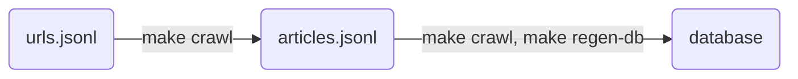

# climate-news-db

The climate-news-db has two goals:

1. create a dataset of climate change newspaper articles for NLP researchers, 
2. provide a web application for users to view climate change news.

# Use

## Crawling URLs

Pulls `urls.jsonl` from S3 and crawls articles into `articles/{newspaper}.jsonl` and into database:

```shell-session
$ make crawl
```

## Regenerate Database

Take urls from `articles/{newspaper}.jsonl` and saves into database:

```shell-session
$ make regen-db
```

This is useful when you want to re-create the database without scraping articles.

## Interactive Search for Getting URLs

Requires Go + Gum

```shell-session
$ ./scripts/search-cli.sh
```

# Data Artifacts

## Lineage



## urls.jsonl

```jsonl
{"url": "https://www.chinadaily.com.cn/a/202302/21/WS63f4aea4a31057c47ebb004e.html", "search_time_utc": "2023-03-20T00:05:02.998560"}
{"url": "https://www.chinadaily.com.cn/a/202301/19/WS63c8a4a8a31057c47ebaa8e4.html", "search_time_utc": "2023-03-20T00:05:02.998560"}
```

Append only storage of raw newspaper urls.  Created by a daily Google search for each newspaper with the keywords `climate change` and `climate crisis`.  This file contains many duplicates.

# Infra

## Webapp

Deployed as a Fly.IO app:

```shell-session
$ make deploy
```

## AWS Infra

Deployed with AWS CDK:

```shell-session
$ make aws-infra
```
