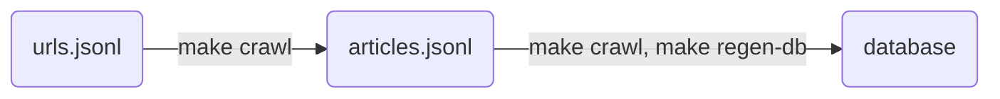

# climate-news-db

The climate-news-db has two goals - to create a dataset of climate change newspaper articles for NLP researchers and to provide a public interface for users to view climate change news.

# Use




## Crawling URLs

Scrapes each url in `urls.jsonl` and saves into articles/{newspaper}.jsonl and to database:

```shell-session
$ make crawl
```

## Regenerate Database

Take urls from `articles/{newspaper}.jsonl` and saves into database:

```shell-session
$ make regen-db
```

This is useful when you want to re-create the database without scraping articles.

## Interactive Search for Getting URLs

Requires Go + Gum

```shell-session
$ ./scripts/search-cli.sh
```

## Statistics

- number of rejected urls by newspaper,
- number of parsed urls,

# Data Artifacts

{"url": "https://www.chinadaily.com.cn/a/202302/21/WS63f4aea4a31057c47ebb004e.html", "search_time_utc": "2023-03-20T00:05:02.998560"}
{"url": "https://www.chinadaily.com.cn/a/202301/19/WS63c8a4a8a31057c47ebaa8e4.html", "search_time_utc": "2023-03-20T00:05:02.998560"}

## urls.jsonl

Append only storage of raw newspaper urls.  Created by a daily Google search for each newspaper with the keywords `climate change` and `climate crisis`.  This file contains many duplicates.

# Data Lineage
Data linage chart
- lambda -> database on s3

# Deployment

- scraper
- flyio
