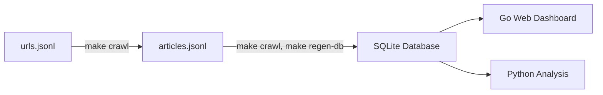

# Climate News Database

A comprehensive system for collecting, storing, and visualizing climate change news articles from major international newspapers.

1. create a dataset of climate change newspaper articles for NLP researchers,
2. provide a web application for users to view climate change news.

## Overview

The climate-news-db serves two primary purposes:

1. **Research Dataset**: Create a curated dataset of climate change newspaper articles for NLP researchers and data scientists
2. **Web Visualization**: Provide interactive web applications to explore and analyze climate news coverage patterns

## Architecture

The project consists of two main components:

### Python Data Pipeline
- **Web scraping** using Scrapy framework
- **Data processing** and storage in SQLite database
- **Article analysis** using GPT for scientific accuracy and tone assessment

### Go Web Dashboard
- **Modern web interface** built with Go + Gin framework
- **Responsive design** using Tailwind CSS
- **Real-time statistics** and newspaper comparison

## Quick Start

### Data Collection

**Crawl articles from newspaper URLs:**
```bash
make crawl
```
Pulls `urls.jsonl` from S3 and crawls articles into `articles/{newspaper}.jsonl` and database.

**Regenerate database from existing articles:**
```bash
make regen-db
```
Rebuilds the SQLite database from local `articles/{newspaper}.jsonl` files without re-scraping.

### Web Dashboard

**Run the Go web dashboard:**
```bash
cd webapp
go mod tidy
go run .
```
Visit `http://localhost:8080` to view the interactive dashboard.

**Features:**
- 📊 **Statistics Overview**: Total newspapers (22), articles (16,532), and average lengths
- 📰 **Newspaper Directory**: Alphabetically sorted list with article counts and website links
- 🎨 **Clean Interface**: Responsive design optimized for desktop and mobile
- 🔍 **Easy Navigation**: Color-coded newspapers with direct website access

### Interactive URL Search

**Search for articles interactively** (requires Go + Gum):
```bash
./scripts/search-cli.sh
```

## Data Flow


```mermaid
graph LR
    A[urls.jsonl] -->|make crawl| B[articles.jsonl]
    B -->|make crawl, make regen-db| C[SQLite Database]
    C --> D[Go Web Dashboard]
    C --> E[Python Analysis]
```

## Data Formats

### URLs (`urls.jsonl`)
```jsonl
{"url": "https://www.chinadaily.com.cn/a/202302/21/WS63f4aea4a31057c47ebb004e.html", "search_time_utc": "2023-03-20T00:05:02.998560"}
{"url": "https://www.chinadaily.com.cn/a/202301/19/WS63c8a4a8a31057c47ebaa8e4.html", "search_time_utc": "2023-03-20T00:05:02.998560"}
```

Append only storage of raw newspaper urls.  Created by a daily Google search for each newspaper with the keywords `climate change` and `climate crisis`.  This file contains many duplicates.

## articles.jsonl

Stored per newspaper in `articles/{newspaper}.jsonl`

```json
{
  "article_name": "climate-change-no-room-for-debate",
  "article_start_url": "http://america.aljazeera.com/watch/shows/techknow/articles/2015/4/6/climate-change-no-room-for-debate.html",
  "article_url": "http://america.aljazeera.com/watch/shows/techknow/articles/2015/4/6/climate-change-no-room-for-debate.html",
  "body": "weve looked at some of the disputes involved with the debate on climate change and how at least one city is dealing with the effects now. Heres a guide to some of issues involved. 97% of Published Reports Agree Climate Change is Fueled by Man-Made Greenhouse Gas Emissions: Everyone from President Obama to climate scientists themselves misrepresent this figure, often noting that 97% of scientists say that climate change exists and it is humankinds fault. The 97% figure actually refers to published papers linking climate change to manmade greenhouse gas emissions. 97% of that research points to fossil fuel emissions of C02 for climate change. Its a big number. Nevertheless, there's a tiny minority of scientists who disagree with the vast majority of scientists who say greenhouse gas emissions are causing the earths climate to change at an unnatural pace. What's Climate Change Doing? You may have seen Senator James Inhofe from Oklahoma holding up a snowball as evidence that climate change is not creating a warming earth. And while weve gone from calling it Global Warming to Climate Change, the extremes in weather are coming more frequently and in greater intensity according to many scientists. The biggest concern is the melting of the glaciers in the Arctic and Antarctic. Hasn't There Has Always Been Climate Change? There has been climate change ever since the earth got an atmosphere. No one disputes that. The overwhelming number of climate scientists are concerned that the greenhouse gases we emit when we burn coal, oil and natural gas - those coming out of your car tailpipe and power plants are sending carbon dioxide into the atmosphere. And that's trapping heat and raising temperatures in the ocean and the atmosphere at too high a rate. Those who disagree say the climate models that are predicting doom are overstating the case and point to a recent hiatus in the rapid increase in some temperature readings...",
  "date_published": "2015-06-15",
  "datetime_crawled_utc": "2023-09-11 16:09:13"
  "headline": "Climate change: no room for debate?",
}
```

### Database Schema

**Newspapers Table:**
- 22 major international news sources
- Metadata: name, website, color coding
- Real-time statistics: article counts, average lengths

**Articles Table:**
- 16,532+ articles across all newspapers
- Full text content and metadata
- Publication dates from 2008-2025

**GPT Opinions Table:**
- AI analysis of article scientific accuracy
- Tone assessment and topic categorization
- 30+ analyzed articles with detailed insights

## Newspaper Sources

The database includes articles from major international newspapers:

- **English**: The Guardian, BBC, CNN, Fox News, New York Times, Washington Post
- **International**: Al Jazeera, Deutsche Welle, China Daily
- **Regional**: Sky News Australia, NewsHub.co.nz, Stuff.co.nz
- **Specialized**: The Atlantic, The Economist, The Independent
- **And 8 more** major news sources

## Technology Stack

### Backend
- **Python**: Scrapy for web scraping, SQLModel for database ORM
- **Go**: Gin web framework for the dashboard API
- **SQLite**: Lightweight database for development and research

### Frontend
- **Tailwind CSS**: Utility-first CSS framework
- **Vanilla JavaScript**: Minimal client-side requirements
- **Responsive Design**: Mobile-first approach

### Infrastructure
- **Fly.io**: Web application deployment
- **AWS CDK**: Infrastructure as code
- **S3**: URL storage and backups

## Development

### Local Setup

**Python Environment:**
```bash
poetry install
poetry shell
```

**Go Dashboard:**
```bash
cd webapp
go mod tidy
go run .
```

**Database Access:**
```bash
sqlite3 data/db.sqlite
```

### Testing

**Test Go webapp with Playwright:**
```bash
cd webapp
npm install playwright
npx playwright install
node test-webapp.js
```

## Deployment

### Web Application
```bash
make deploy
```

### AWS Infrastructure
```bash
make aws-infra
```

## Documentation

- **Go Webapp Details**: See `docs/go-rebuild.md` for technical implementation
- **Database Schema**: View with `sqlite3 data/db.sqlite .schema`
- **API Endpoints**: Main dashboard at `/` with newspaper statistics

## Contributing

1. **Data Quality**: Help improve article extraction and deduplication
2. **Analysis**: Contribute GPT-based article analysis and insights
3. **Visualization**: Enhance the web dashboard with new features
4. **Sources**: Suggest additional newspaper sources for broader coverage

## Research Applications

This dataset supports research in:
- **Climate Communication**: How different outlets frame climate issues
- **Temporal Analysis**: Evolution of climate news coverage over time
- **Geographic Patterns**: Regional differences in climate reporting
- **NLP Studies**: Text analysis, sentiment analysis, topic modeling
- **Media Bias**: Comparative analysis of reporting approaches

## License & Usage

This project aggregates publicly available news articles for research purposes. Please respect newspaper copyrights and terms of service when using this data.
